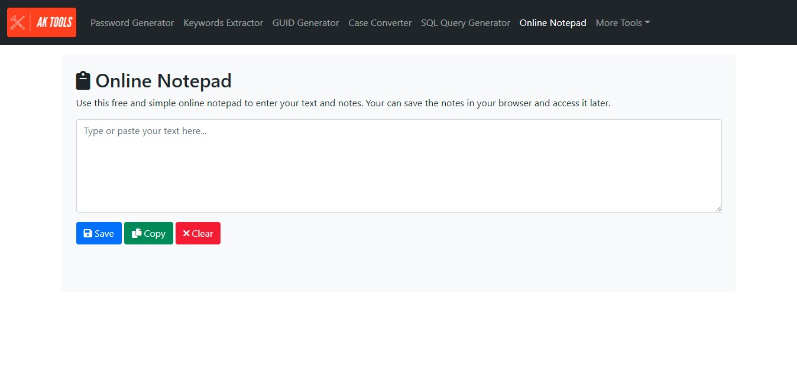

# text-notepad

Basic online text notepad

  <kbd>
    
  </kbd>

## Description

A simple online text notepad to write your text and notes. Your can temporarily save the notes in your browser and access them later.

### Features

- Write Texts
- Save in Browser Session
- No Authentication Required

### Built with

- Javascript
- HTML + CSS

### Demo

- [aktools.net/notepad/](https://aktools.net/notepad/)

## Getting started

### Install

All you have to do is download the source files, no configurations needed. Place the the files somewhere on your system and open the `index.html` file located at: `\text-notepad\index.html`

### Usage

Simply copy and paste your text into the text area. Click on the the Save button to save text or Copy button to the text to clipboard.

### See also

- [password-generator](https://github.com/akassama/password-generator)
- [sql-query-generator](https://github.com/akassama/sql-query-generator)
- [case-converter](https://github.com/akassama/case-converter)
- [guid-generator](https://github.com/akassama/guid-generator)
- [keywords-extractor](https://github.com/akassama/keywords-extractor)
- [jquery-character-counter](https://github.com/akassama/jquery-character-counter)
- [bootstrap-search-autocomplete](https://github.com/akassama/bootstrap-search-autocomplete)
- [jquery-datables-crud](https://github.com/akassama/jquery-datables-crud)
- [bootstrap-search-autocomplete](https://github.com/akassama/bootstrap-search-autocomplete)
- [akassama-projects](https://github.com/akassama/projects)

### License

This project is licensed under the [MIT License](https://opensource.org/licenses/MIT).